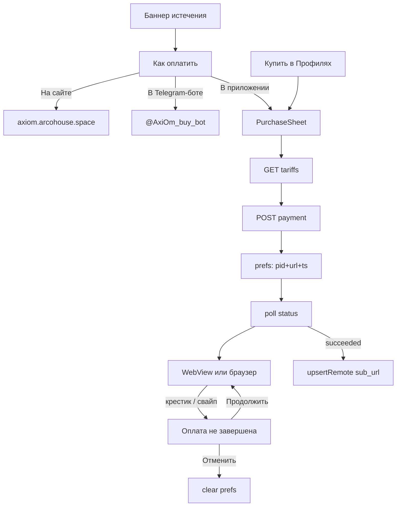

# In-app payment (`feature/in-app-payment`)

Оплата и продление подписки из приложения без обязательного ухода в Telegram-бота.

**Целевые платформы:** Android и Windows.  
**Не в scope:** iOS (сборка/поддержка оплаты под iOS не делается).

## Новые возможности (сводка)

| Фича | Поведение |
|------|-----------|
| **Покупка в приложении** | Тарифы с API (+ промокод) → платёж → страница оплаты → опрос → импорт и **активный** профиль (при включённом VPN — автоматический реконнект) |
| **Баннер истечения** | Тап → выбор способа: в приложении / на сайте / в Telegram-боте |
| **Купить из Профилей** | «Продлить / купить» → `showPurchaseOptions`; pending → лист recovery |
| **ЛК во вкладке Профили** | Тариф, дни, трафик; «Продлить»; «Привязать Telegram»; «Поддержка» — без отдельного экрана |
| **Android WebView** | Оплата внутри приложения; СБП / банк — схемы `sbolpay:` / `intent:` уходят в систему |
| **Windows** | Страница оплаты в системном браузере + опрос статуса в листе |
| **Незавершённая оплата** | `pending_payment` = `{pid, url, ts}`; после выхода из WebView — «Продолжить» / «Отменить» / «Проверить снова» (отмена сверяет статус на сервере) |
| **Чип в Профилях** | «Есть незавершённая оплата» → открывает лист с recovery |
| **Опрос до WebView** | Статус крутится, пока пользователь в банке (СБП), не ждёт закрытия экрана оплаты |
| **Гостевая покупка** | Без Telegram-логина; при успехе импорт профиля + опционально `claim_url` |

Открыть из кода: `showPurchaseOptions(context)` — выбор способа; `showPurchaseSheet(context)` — сразу лист тарифов.



## Зачем

Раньше баннер истечения всегда открывал `@AxiOm_buy_bot`. Покупка шла вне приложения, а ссылка на подписку возвращалась вручную.

Теперь при **уже истёкшей** подписке приложение само:

1. запрашивает каталог тарифов с бэкенда;
2. создаёт платёж;
3. открывает страницу оплаты;
4. опрашивает статус;
5. импортирует `sub_url` в профили (и обновляет аккаунт, если пользователь залогинен).

Тарифы **не зашиты** в клиент: цены и состав меняются на сервере, а выпущенная сборка обновляется не у всех сразу.

## Поведение баннера истечения

Баннер по-прежнему показывается в двух состояниях (осталось ≤ 3 дней / уже истекла) и различается текстом и цветом, но **тап в обоих случаях открывает один и тот же выбор способа оплаты** ([`purchase_options_sheet.dart`](../lib/features/account/widget/purchase_options_sheet.dart)):

| Способ | Куда ведёт | Чем полезен |
|--------|-----------|-------------|
| **В приложении** | `PurchaseSheet` | Короткий путь: карта или СБП без выхода из AxiOm |
| **На сайте** | `Constants.purchaseSiteUrl` → `https://axiom.arcohouse.space` | Промокоды и сравнение тарифов — в приложении их нет |
| **В Telegram-боте** | `Constants.telegramBuyBotUrl` | История покупок и поддержка в одном месте |

Раньше баннер выбирал маршрут сам: до истечения уводил в бота, после — открывал лист оплаты. Пользователю это деление было не видно, а маршруты не взаимозаменяемы (промокод есть только на сайте, история — только в боте), поэтому выбор отдан ему.

Действие выполняется на контексте баннера, а не закрытого листа: лист возвращает выбор через `pop`, и уже вызывающая сторона открывает лист покупки или ссылку.

Баннер можно скрыть крестиком до перезапуска приложения (не персистится).

## Платформы: как открывается оплата

| Платформа | Страница оплаты |
|-----------|-----------------|
| **Android** | Встроенный WebView (`PaymentWebViewPage`) |
| **Windows** | Системный браузер (`url_launcher`) |
| iOS / прочее | Не целевые; WebView для оплаты не используется |

На Android закрытие WebView завязано на редирект return URL с маркером `paid=1`. Опрос `/api/app/payment/status` стартует **до** открытия страницы оплаты (раз в 3 с, потолок 15 мин): пока пользователь в приложении банка по СБП, статус уже подтягивается; если WebView закрыли руками после оплаты — тоже.

Маркер ищется как **query-параметр** (`paid=1`), а не подстрокой всего URL: подстрока могла бы встретиться на промежуточной странице платёжки и закрыть оплату на полпути. Реальный return URL берётся из `PAYMENT_RETURN_URL` на бэкенде (`https://design.arcohouse.space/?paid=1`).

На Windows колбэка из браузера нет — подтверждение только через опрос статуса. В листе показывается подсказка вернуться в приложение после оплаты.

### СБП и приложения банков

Платёжка уводит на **не-http(s)** схемы (`sbolpay:`, `bank100000000111:`, `intent:`) — WebView такую ссылку отрисовать не может и показывает страницу ошибки, на чём оплата и заканчивается. Поэтому `onNavigationRequest` отдаёт всё, кроме `http`/`https`, системе (`launchUrl(..., externalApplication)`) и отменяет навигацию внутри WebView.

`canLaunchUrl` перед этим **намеренно не вызывается**: на Android 11+ он отвечает `false` для схемы, не перечисленной в `<queries>` манифеста, а перечислить все банковские приложения невозможно. Вместо проверки — `try/catch` вокруг запуска.

### Незавершённая оплата (выход из WebView / свайп листа)

Перед открытием страницы оплаты в `SharedPreferences` пишется ключ `pending_payment`:

```json
{"pid": "...", "url": "https://...", "ts": 1710000000}
```

`url` нужен, чтобы после закрытия WebView крестиком можно было **открыть ту же страницу оплаты снова** — одного `pid` для этого мало.

При открытии листа (`showPurchaseSheet`) сохранённый платёж подхватывается: опрос статуса продолжается, сверху показывается блок **«Оплата не завершена»** с действиями:

| Кнопка | Действие |
|--------|----------|
| **Продолжить оплату** | снова WebView / браузер по сохранённому `url` + опрос |
| **Проверить снова** | после таймаута 15 мин — перезапуск опроса без нового заказа |
| **Отменить ожидание** | сверка статуса на сервере → стоп таймера, очистка prefs, тарифы снова доступны |

Кнопка отменяет **ожидание**, а не платёж, поэтому перед очисткой делается один запрос `/payment/status`: её жмут и после успешной оплаты (опрос не успел тикнуть, моргнула сеть), а для гостя без Telegram-аккаунта очистка prefs означала бы потерю `sub_url` и `claim_url` без шанса восстановить. Если статус `succeeded` — показывается экран успеха вместо отмены; если сервер недоступен — отменяем, как просили, и пишем в лог.

Пока опрос идёт, карточка называется **«Ожидаем оплату»**, и только после таймаута или остановки — «Оплата не завершена»: штатное ожидание не должно выглядеть проблемой.

Запись удаляется при `succeeded`, `canceled`, `not_found`, по кнопке «Отменить ожидание» и по возрасту старше **24 часов**. Таймаут опроса (15 мин) **не** чистит prefs — можно проверить статус или открыть оплату снова.

Хелпер: `showPurchaseSheet(context)` в `purchase_sheet.dart`. Баннер истечения и вкладка Профили открывают один и тот же лист.

### Вкладка Профили (личный кабинет)

Всё в [`account_section.dart`](../lib/features/account/widget/account_section.dart) / [`account_subscription_tile.dart`](../lib/features/account/widget/account_subscription_tile.dart) — **не** отдельный экран:

- **Залогинен:** имя, подписки (тариф, трафик, `до <дата> · <остаток>`), кнопка **«Продлить»** на плитке → `showPurchaseOptions`; меню обновить/выйти.
- **Гость:** карточка **«Привязать Telegram»** + пояснение, что купить можно и без привязки.
- Общие кнопки снизу: **«Продлить / купить»** (или «Продолжить оплату» при pending) и **«Поддержка»** (`Constants.telegramSupportBotUrl`).

Входов в покупку ровно два и они не дублируются: кнопка на плитке продлевает **конкретную** подписку, нижняя кнопка — общий вход (единственный для гостя и для пользователя без подписок). Третья кнопка «Продлить подписку» в карточке аккаунта убрана как буквальный дубль нижней.

Строки ЛК берутся из переводов (`pages.profiles.account`), а не зашиты в виджеты: интерфейс мультиязычный, и русские литералы давали бы смесь языков. Новые ключи добавлены в `en` (базовая локаль) и `ru`; для остальных языков сработает `fallback_strategy: base_locale`, так что английский будет везде. После правки `assets/translations/*.i18n.json` нужен `dart run build_runner build --delete-conflicting-outputs`.
- Чип незавершённой оплаты → сразу `PurchaseSheet` (recovery).

### Купленный профиль становится активным

После импорта `importSubUrl` находит запись через `profileDataSource.getByUrl` и делает её активной (`selectActiveProfile`). Ошибка здесь не ломает экран успеха — профиль всё равно добавлен, просто не выбран.

⚠️ **Побочный эффект, о котором стоит знать:** смену активного профиля слушает `connection_notifier.dart` и при разнице id вызывает `reconnect`. Если в момент подтверждения оплаты VPN включён, соединение разорвётся и поднимется заново уже на новой подписке. Это то, что нужно (старая подписка кончилась), но происходит молча, поэтому на экране успеха теперь сказано, что приложение переключилось на новую подписку.

### Дни и дата в плитке подписки

Одна строка: `до <дата> · <остаток>`. Отдельная строка с остатком дней дублировала дату вместе с подсветкой срочности, поэтому убрана.

`daysLeft` округляет **прошедшее** время от нуля: обычное усечение показывало подписку, умершую 12 часов назад, как «Последний день», то есть как живую. Остаток времени по-прежнему усекается — полдня в запасе это и есть последний день.

### Промокод

В `PurchaseSheet` перед списком тарифов — поле «Промокод». Значение уходит в `POST /payment` как `promo` (пустая строка не отправляется). 100% скидка по-прежнему может вернуть `{status: succeeded, sub_url}` без WebView.

Сервер приводит код к верхнему регистру и принимает в этом поле **и** промокод, **и** реферальный код (`create_payment_core`). На неизвестный код отвечает `400 {"error": "Код недействителен или исчерпан"}` — этот текст показывается как есть; тело разбирается и когда приходит строкой, а не JSON-объектом.

Цена в списке скидку **не** учитывает — итог виден только на странице оплаты. Отдельной проверки промокода в приложении нет (на бэкенде для сайта есть `/api/web/promo`).

### Активный профиль после оплаты

После `upsertRemote(sub_url)` клиент находит запись по URL и вызывает `selectActiveProfile`, чтобы новый/обновлённый профиль сразу стал активным.

## API (бэкенд уже развёрнут)

База: `Constants.accountApiBaseUrl` → `https://axiom.arcohouse.space`

| Метод | Эндпоинт | Назначение |
|-------|----------|------------|
| `GET` | `/api/app/tariffs` | Каталог тарифов |
| `POST` | `/api/app/payment` | Создать платёж (`tariff_idx`, опционально `method`, `promo`) |
| `GET` | `/api/app/payment/status?pid=…` | Статус: `pending` \| `succeeded` \| `canceled` \| `not_found` |

Авторизация опциональна:

- с `Authorization: Bearer <session>` покупка привязывается к Telegram-аккаунту;
- без токена в ответе успеха может прийти `claim_url` для привязки позже.

Ошибки показываются человеческим текстом, а не `DioException`: 429 → «Сервер занят, попробуйте через минуту», поле `error` из тела ответа — как есть, отсутствие ответа → «Нет связи с сервером».

Ответ создания платежа:

- обычный путь: `{ payment_id, payment_url }`;
- 100% скидка: `{ status: "succeeded", sub_url }` — платить не нужно.

Успешный статус / бесплатная выдача:

- `sub_url` — ссылка подписки (импортируется в профили);
- опционально `claim_url` — кнопка «Привязать» в UI.

Клиент: `lib/features/account/data/account_api.dart`  
(`getTariffs`, `createPayment`, `getPaymentStatus`).

## Файлы в ветке

| Файл | Роль |
|------|------|
| `lib/features/account/widget/home_expiry_banner.dart` | Баннер истечения → выбор способа оплаты |
| `lib/features/account/widget/purchase_options_sheet.dart` | Лист «Как оплатить»: приложение / сайт / бот |
| `lib/features/account/widget/purchase_sheet.dart` | Лист тарифов, оплата, опрос, recovery, `showPurchaseSheet` |
| `lib/features/account/widget/payment_webview_page.dart` | WebView оплаты (Android) |
| `lib/features/account/widget/account_section.dart` | ЛК в Профилях: купить / pending |
| `lib/features/account/data/account_api.dart` | HTTP к тарифам/платежам |
| `pubspec.yaml` | `webview_flutter` (нужен для Android) |

## Гостевая покупка vs аккаунт

- **Залогинен:** после успеха вызывается `accountNotifier.refresh()` → автоимпорт активных подписок + явный `upsertRemote(sub_url)`.
- **Гость:** `sub_url` всё равно импортируется в профили; если импорт не удался — текст просит скопировать ссылку вручную; при наличии `claim_url` показывается «Привязать».

## Проверка перед мержем / релизом

1. `flutter pub get`
2. `dart analyze` по затронутым файлам account/widget + account_api
3. Сборка **Android** release APK и сценарии:
   - тап по баннеру (в обоих состояниях) → «Как оплатить» → все три маршрута открываются;
   - «В приложении» → тарифы → оплата в WebView → успех → профиль появился;
   - гость без Telegram-логина;
   - залогиненный аккаунт;
   - **закрыть WebView крестиком** → «Продолжить оплату» / «Отменить ожидание»;
   - **смахнуть лист** после создания платежа → Профили → чип незавершённой оплаты → recovery;
   - **СБП / оплата через приложение банка**: WebView отдаёт ссылку системе, банк открывается, после возврата опрос подтверждает оплату;
   - **«Отменить ожидание» после реальной оплаты** → вместо отмены показывается экран успеха.
4. Сборка **Windows** и сценарий: истекла → тарифы → браузер → после оплаты статус в листе → профиль.
5. Бамп версии в `pubspec.yaml` / appcast при выкладке (ветка пока на базе 4.3.2).

## Лимиты на сервере

`/api/app/payment/status` ограничен 60 запросами в минуту, ключ — **`pid`** (`app_api.py`, `handle_app_payment_status`; выкачено на RU 02.09.2026).

Раньше ключом был `Authorization` или IP клиента, и это ломалось именно у гостей: приложение ходит к API через собственный туннель, поэтому сервер видит IP выходного узла, общий для всех за ним. Опрос даёт 20 запросов в минуту на человека — трое одновременно платящих гостей за одним узлом выбирали лимит, и остальные получали `429` вместо подтверждения оплаты. Платёж принадлежит одному покупателю, так что ключ по `pid` и честнее, и не задевает соседей; своих 60 в минуту одному опросу хватает втрое.

Проверено на боевом: 60 запросов с одним `pid` проходят, 61-й отдаёт `429`, запрос с другим `pid` в этот же момент — обычный ответ.

Остальные лимиты не менялись: `/api/app/payment` — 10/мин по `Authorization` или IP (создание платежа к `pid` не привязать), `/api/app/tariffs` — 60/мин по IP.

## Известные ограничения

- Старый `pending_payment` без поля `url` (сборки до этого фикса) всё ещё resume’ит опрос, но кнопка «Продолжить оплату» скрыта — только «Проверить снова» / «Отменить ожидание» или новый заказ после отмены.

## Вне scope

- iOS: не поддерживаем, WebView оплаты под iOS не целевой путь.
- Выбор метода оплаты в UI (`method` опционален на сервере).
- История платежей в приложении (пока в боте).
